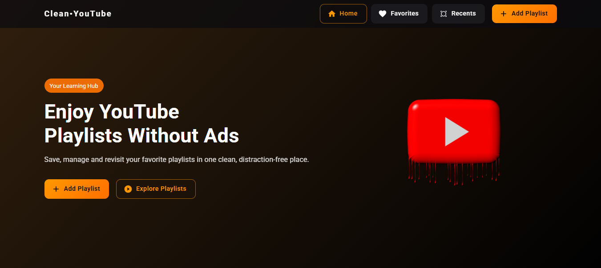

# Clean Youtube Project

## 📚 Table of Contents

- [Description](#-description)
- [Live Demo](#-live-demo)
- [Features](#-features)
- [Benefits](#-benefits)
- [Tech Stack](#️-tech-stack)
- [Setup and Installation](#️-setup-and-installation)
- [Environment Variables](#-environment-variables)
- [Author Info](#-author-info)

## 📝 Description

Clean YouTube is a user-friendly web application designed to enhance your video-watching experience on YouTube. By providing a clean and distraction-free interface, it ensures that users can focus solely on their selected videos without interruptions from ads or cluttered layouts. Users can manage playlists, keep track of recently visited playlists, and save their favorites, all while enjoying a seamless and enjoyable experience.

## 🚀 Live Demo

[](https://clean-youtube-app.vercel.app/)

## ✨ Features

#### `Add Playlists by ID, URL, or Search`

- Users can quickly add a playlist by pasting its YouTube URL or Playlist ID.
- Users can also search directly within the app to find and add their own playlists.

#### `Favorites Management`

- Add frequently watched playlists to a favorites section for quick access.
- Remove playlists from favorites as needed.

#### `Recent Playlist Tracking`

- Automatically tracks and displays recently accessed playlists and videos for easy revisiting.

#### `Permanent Playlist Deletion`

- Remove unwanted playlists permanently to keep your library organized and clutter-free.

#### `Live Video Search`

- Users can search in real-time within a playlist to quickly find a specific video

## 💬 Benefits

- No ads while watching videos, ensuring an uninterrupted viewing experience.
- Distraction-free environment tailored for focused video consumption.
- Efficient playlist management with favorites and recent tracking.
- Simple yet powerful controls for adding, managing, and removing playlists.

## 🛠️ Tech Stack

- React 18
- JavaScript
- React Router DOM
- React YouTube
- YouTube Data API
- Material UI
- EasyPeasy
- Axios
- PropTypes

## ⚙️ Setup and Installation

### Step-by-step instructions for cloning and running locally:

```
✅ git clone https://github.com/Mohosin999/Clean-YouTube-App.git

✅ cd Clean-YouTube-App

✅ yarn install

✅ yarn dev
```

**Access app at:**

```
http://localhost:5173
```

## 🔑 Environment Variables

Create a `.env` file in the root directory of the project and add the following variable:

```
VITE_YOUTUBE_API_KEY=
```

## 📬 Author Info

👤 **Mohosin Hasan Akash**

- 💼 **LinkedIn:** [linkedin.com/in/mohosinh99/](https://www.linkedin.com/in/mohosinh99/)
- 🌐 **Portfolio:** [personal-portfolio.com](https://personal-portfolio-website-brown-nine.vercel.app/)
- 📧 **Email:** mohosin.hasan.akash@gmail.com
