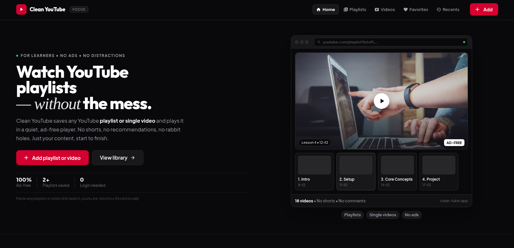

# Clean YouTube

## 📚 Table of Contents

- [Description](#-description)
- [Live Demo](#-live-demo)
- [Features](#-features)
- [Benefits](#-benefits)
- [Tech Stack](#️-tech-stack)
- [Setup and Installation](#️-setup-and-installation)
- [Environment Variables](#-environment-variables)
- [Author Info](#-author-info)

## 📝 Description

Clean YouTube is a distraction-free YouTube experience for focused learning. Save any **playlist or single video** and watch it in a clean, ad-free player — no shorts, no recommendations, no clutter. Your library (playlists + videos) lives locally in the browser, with separate pages for Playlists and Videos, plus Favorites and Recents.

## 🚀 Live Demo

[](https://clean-youtube-app.vercel.app/)

## ✨ Features

#### `Add Playlists by ID, URL, or Search`

- Paste any YouTube playlist URL (`playlist?list=PL...`) or Playlist ID.
- Search YouTube for playlists directly from the app (`Search` in Add dialog).

#### `Add Single Videos`

- Paste any single video link — `watch?v=`, `youtu.be/`, `shorts/`, `embed/` or raw `11-char ID`.
- Video metadata (title, thumbnail, channel) is fetched via `youtube/v3/videos` and stored locally.
- Dedicated **Videos** library at `/videos` — same clean card layout as Playlists, but without search.

#### `Separate Libraries`

- **Home `/`** — editorial landing (no library), intro + benefits.
- **Playlists `/playlists`** — searchable grid of all saved playlists (sticky Search bar).
- **Videos `/videos`** — grid of single videos (no search, intentional plain view).

#### `Watch Experience`

- **Playlist Player `/player/:playlistId`** — left info + search inside playlist, featured 2 videos + All Videos grid, ad-free.
- **Playlist Video `/player/:playlistId/:index?videoId=`** — YouTube player with progress bar, Previous/Next/Close, Up Next queue.
- **Single Video `/watch/:videoId`** — single ad-free player with channel, date, description, favorite toggle, Back to Videos / Open on YouTube.

#### `Favorites Management`

- Heart any **playlist or single video** — Videos, Playlist cards, and Watch/Player pages all have the heart.
- Favorites page `/favorites` shows **Playlists + Videos in two sections** (counts in header).

#### `Recent Playlist Tracking`

- Opening a playlist adds it to Recents (max 8, most recent first).
- Recents page `/recents` — same spacing/design as Favorites (`pt:4`, `bg #09090B`).

#### `Permanent Deletion`

- Delete playlists from Playlists grid (also clears from Favorites/Recents).
- Delete single videos from Videos grid (also clears from Favorites). No backend — localStorage only.

#### `Live Search`

- In Playlists library: realtime filter by title/channel.
- Inside a playlist: instant filter videos by title.

## 💬 Benefits

- No ads while watching — playlists and single videos.
- Zero distractions: no shorts, no recommendations, no autoplay traps.
- Playlist **and** single video support — save a full course or just one talk.
- Favorite + Recent + ad-free study mode for deep work.
- 100% local — no login, no tracking, instant.

## 🛠️ Tech Stack

- React 18 + Vite 5
- React Router DOM 7
- React YouTube
- YouTube Data API v3 (`playlists`, `playlistItems`, `videos`, `search`)
- Material UI 6 + Emotion
- EasyPeasy (persist + localStorage) — `playlists`, `videos`, `favorites`, `recents`
- Axios, Framer Motion, PropTypes

## ⚙️ Setup and Installation

```
✅ git clone https://github.com/Mohosin999/Clean-YouTube-App.git
✅ cd Clean-YouTube-App
✅ yarn install
✅ yarn dev
```

**Access app at:**

```
http://localhost:5173
```

Routes: `/` (Home) • `/playlists` • `/videos` • `/watch/:videoId` • `/player/:playlistId` • `/favorites` • `/recents`

## 🔑 Environment Variables

Create a `.env` file in the root and add:

```
VITE_YOUTUBE_API_KEY=
```

## 📬 Author Info

👤 **Mohosin Hasan Akash**

- 💼 **LinkedIn:** [linkedin.com/in/mohosinh99/](https://www.linkedin.com/in/mohosinh99/)
- 🌐 **Portfolio:** [personal-portfolio.com](https://mohosin.vercel.app/)
- 📧 **Email:** mohosin.hasan.akash@gmail.com
